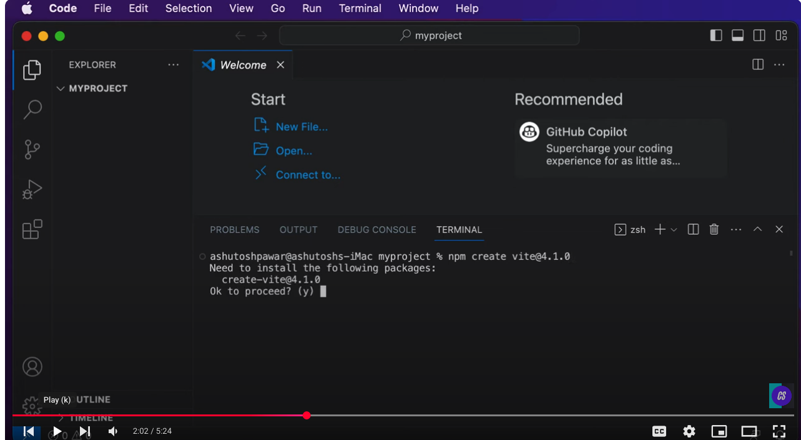
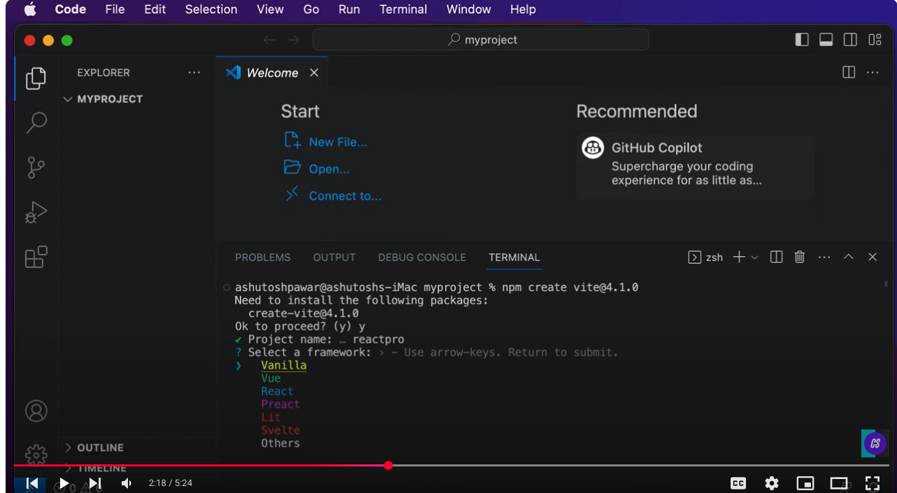
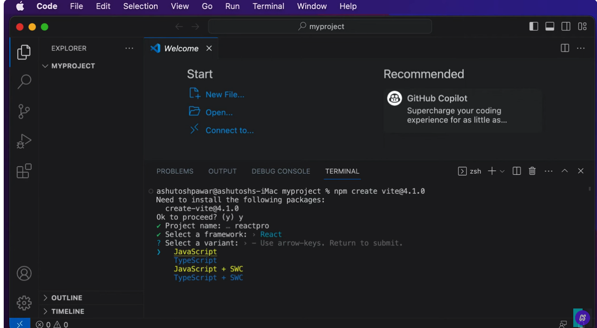

# react-dev


npm create vite@4.1.0 
Step 1: Asked to enter the project name: reactpro
Step 2: Select a framework: react
Step 3: Select a variant: javascript
Step 4: To change to react folder,  and install npm and npm run dev

'''
cd reactpro  & 
npm install & npm run dev
```
 

