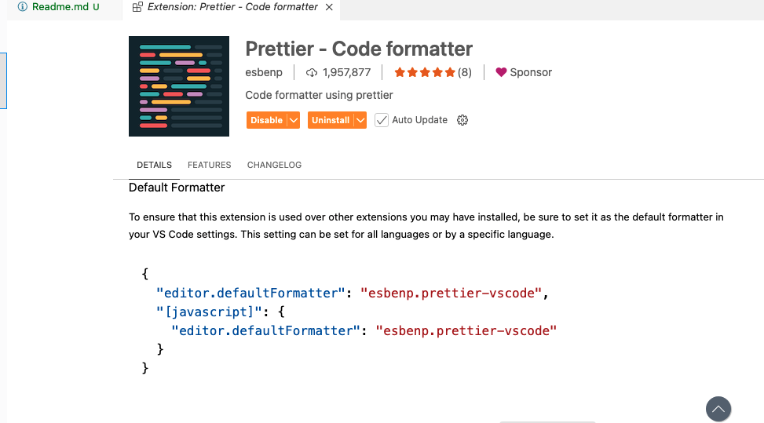
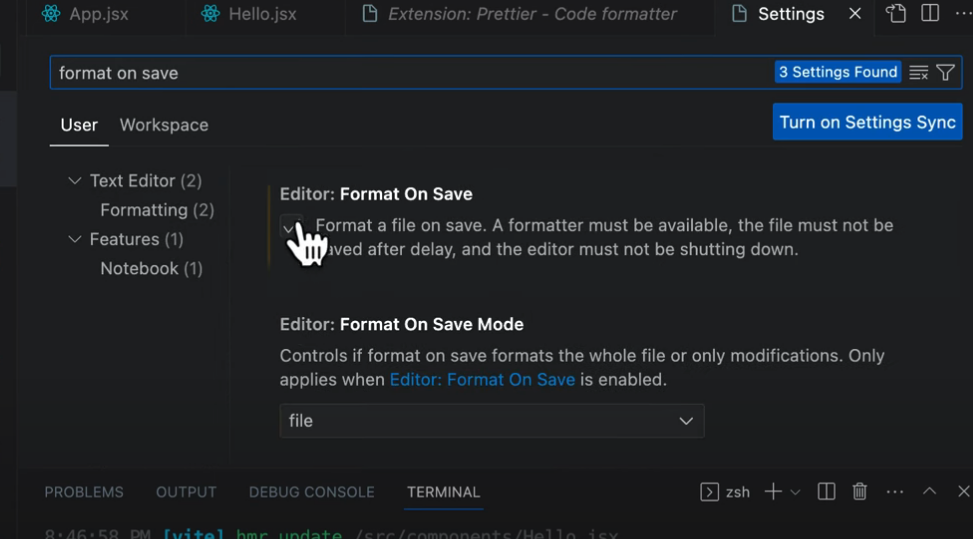

Install the Prettier Format Extension
Open the extension where you find a json object with Prettier settings. 
as mentioned below.

Copy the block and open vscode settings, open setting as json and save to file
```
{
  "editor.defaultFormatter": "esbenp.prettier-vscode",
  "[javascript]": {
    "editor.defaultFormatter": "esbenp.prettier-vscode"
  }
}
```
After saving to the code, 
you have reopen the settings and select Format on Save



