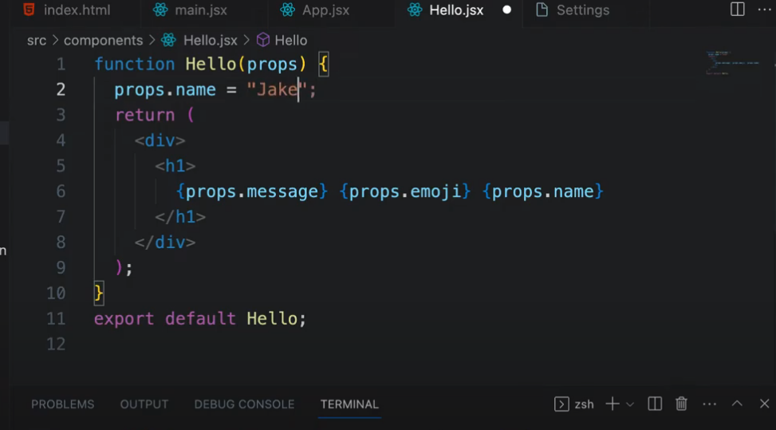
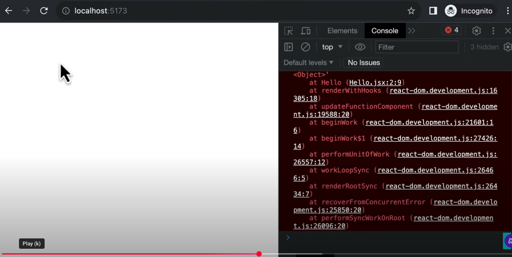

as per reactjs, pros are immutable and can not be modified

React throws an error

You can modify in ReactJS-CodeStoic/ReactJS-Tutorial-09-WhatarePropsInReact and check the behaviour. Hence skipping to create the app.
