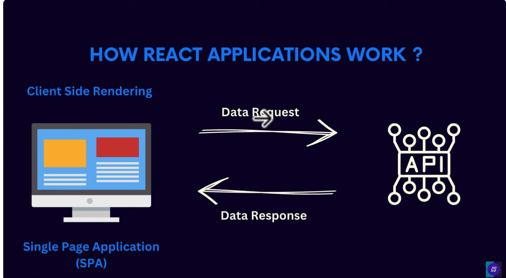
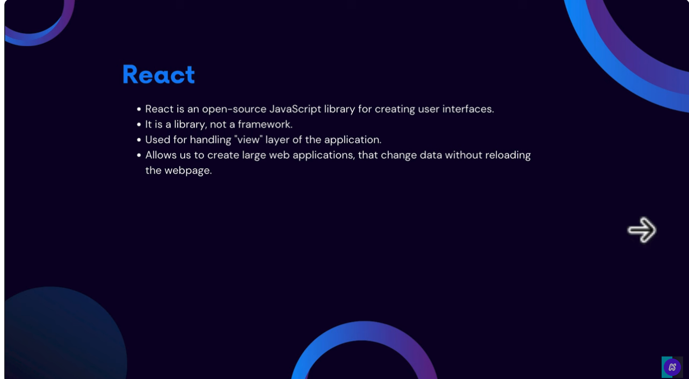

ReactJS Tutorial 1

https://www.youtube.com/watch?v=MHn66JJH5zs

Service Side Rendering

How Websites Evolved

More Interactivity
Fully Fledged web applications
Modern applications on browser run lik native apps

More Interactivity -> More JavaScript
Increased complexity ->More Bugs
Manually updation of DOM

How React Application Works

Client Side Rendering -> 
Single Page Application - (SPA) -> Data Request. - <API>
                                <- Data Response

What is React

* Open JavaScript Library for creating user Interfaces
it is a library, not a framework
Used for handling "view" layer of the application

Allow us to create large web applications, that changes data without reloading
the webpage

